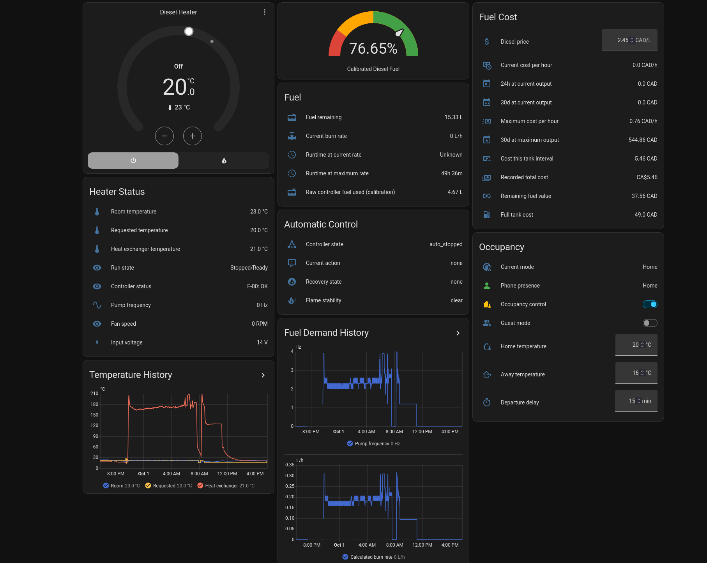

<p align="center">
  
</p>

<h1 align="center">Afterburner Helper</h1>

<p align="center">
  Fuel intelligence and climate automation for Afterburner-equipped diesel heaters.
</p>

<p align="center">
  <a href="https://github.com/datalorians/afterburner-helper/releases/latest"></a>
  <a href="https://github.com/datalorians/afterburner-helper/actions/workflows/validate.yml"></a>
  <a href="https://www.home-assistant.io/"></a>
  <a href="LICENSE"></a>
</p>

Afterburner Helper turns the telemetry already published by an
[Afterburner controller](https://gitlab.com/mrjones.id.au/bluetoothheater)
into useful fuel, cost, combustion, and climate-control entities in Home
Assistant. It works alongside the stock heater ECU and Afterburner's normal
start and shutdown commands.

> [!IMPORTANT]
> This is an independent community project. It is not affiliated with or
> endorsed by Afterburner or Home Assistant.

## Dashboard preview

<a href="docs/images/dashboard-overview.png">
  
</a>

<p align="center"><sub>Live Home Assistant dashboard using Afterburner Helper telemetry and controls. Select the image for the full-resolution view.</sub></p>

## Capabilities

| ⛽ Fuel | 🌡️ Climate | 🔥 Combustion | 📈 History |
|:--|:--|:--|:--|
| Pump-frequency fuel model | Setpoint-based start and stop | Ignition-collapse detection | Recorder-ready entities |
| Tank level and runtime | Minimum run/off timing | Low-fire flameout warning | InfluxDB and Grafana friendly |
| Refill calibration | Manual-stop latch | Bounded recovery attempt | Price-at-time-of-use cost ledger |
| Current and projected cost | Optional phone presence | Normal ECU cooldown | Long-term statistics |
| Persistent mixture settings | Multi-page Climate dashboard | Pump/fan map editing | MQTT settings refresh |

The control and fuel logic is covered by 23 dependency-free tests, including
recorded failed-start, flameout, and successful overnight-run cases from a real
Afterburner V3.5.2 installation.

## Install

### HACS

1. In HACS, open **Custom repositories**.
2. Add `https://github.com/datalorians/afterburner-helper` as an
   **Integration** repository.
3. Install **Afterburner Helper** and restart Home Assistant.
4. Open **Settings → Devices & services → Add integration** and select
   **Afterburner Helper**.

### Manual

Copy [`custom_components/afterburner_helper`](custom_components/afterburner_helper)
to `/config/custom_components/afterburner_helper`, restart Home Assistant, and
add the integration from **Devices & services**.

## How climate control works

Active control is optional. When enabled, it uses the room temperature,
Afterburner setpoint, heater state, pump frequency, voltage, and error status to
decide when a normal stop or start is appropriate.

```text
setpoint + stop offset
        │  minimum-fire hold
        ▼
 normal ECU shutdown ──── full cooldown
                              │
setpoint - start offset       │
        └─────────────────────┘
                    │
                    ▼
             normal ECU start
```

An intentional manual stop remains latched until a later setpoint adjustment
enters the configured start range. The integration does not automatically prime
the fuel pump and does not bypass the stock ECU shutdown sequence.

## Staged diesel and electric heat

Version 2.5 provides one master climate control for the complete heating group and
member climate controls for diesel plus two optional smart-plug heaters.

- Choose any of the six diesel / Electric 1 / Electric 2 priority orders.
- Lock out any source independently without losing its configured target.
- Leave a member in **Auto** to follow the master demand.
- Set a member to **Heat** or **Off** for a persistent manual override.
- Assign both electric-heater switch entities in the integration options.
- Propagate every master setpoint change to all three member thermostats.

The master can use either one selected room-temperature sensor or a virtual
fused temperature. The fused sensor accepts any number of Home Assistant
temperature entities, averages every currently available value, and exposes
the contributing and unavailable sensors as attributes. The default fusion
combines the Afterburner room sensor with
`sensor.igneous_bedroom_temperature_ds18b20_2`.

Version 2.6 adds a configurable outdoor reference (defaulting to
`sensor.spare_temperature`), indoor/outdoor and demand/outdoor deltas, and a
dashboard explanation of every fused input and the live arithmetic. These
measurements are ordinary Recorder-compatible sensors for later heat-loss and
weather analysis.

The MQTT settings layer now also exposes cyclic and frost thresholds,
low-voltage cutout, controller/fan type, GPIO states/user outputs/thresholds,
altitude and humidity, firmware/runtime diagnostics, and the controller's
two-step authenticated reboot command. See
[`docs/development-status.md`](docs/development-status.md) for the firmware
boundary and remaining timer/console work.

Automatic staging calls the first available source at 0.3 °C below demand, the
second at 1.5 °C below demand, and the third at 3.0 °C below demand. Locked-out
or manually disabled sources are skipped and the next available source fills
their place. Electric Heater 1 defaults to
`switch.s31_3_sonoff_s31_relay`; Electric Heater 2 is unassigned until selected.

## Fuel and cost accounting

Fuel rate is derived from pump frequency and configurable pump displacement.
Tank capacity, correction factor, and effective maximum pump frequency are all
adjustable.

Cost is accumulated incrementally using the diesel price that was active when
each fuel increment was consumed. Changing today's price does not reprice fuel
that was burned previously.

## Optional Home/Away control

[`examples/diesel_heater_occupancy.yaml`](examples/diesel_heater_occupancy.yaml)
is an optional Home Assistant package that adds:

- immediate restoration of the Home temperature on arrival;
- a configurable Away temperature and departure delay;
- an enable switch and guest override; and
- dashboard-friendly mode and temperature controls.

Replace `person.your_name` and the example entity IDs before using it.

## Dashboards and analytics

The repository includes the complete
[`Climate Control` dashboard](dashboards/climate-control.yaml), with separate
pages for basic climate control, detailed diesel-heater status, electric-heater
expansion, thermostat/cyclic operation, frost protection, fuel and mixture,
timers, GPIO, and system diagnostics. See
[`dashboards/README.md`](dashboards/README.md) for the short sidebar setup step.

Home Assistant intentionally does not provide custom integrations with a
supported API for silently overwriting a user's Lovelace registry or
`configuration.yaml`. The dashboard therefore ships with every installation,
while enabling its sidebar entry remains explicit and non-destructive.

[`examples/dashboard_cards.yaml`](examples/dashboard_cards.yaml) also contains
smaller starter cards. Measurements can be retained by Home Assistant Recorder
or exported to InfluxDB for Grafana dashboards and long-range analysis.
The included [`examples/afterburner_influx.yaml`](examples/afterburner_influx.yaml)
exports the complete fused-temperature model, its source sensors, outdoor
reference and deltas, group climates, and diesel-heater telemetry.

## Controller settings over MQTT

Version 2.3 adds persistent entities for the active Afterburner mixture map:

- minimum and maximum pump frequency;
- minimum and maximum fan speed;
- pump volume per stroke;
- thermostat window; and
- offsets for environmental temperature sensors 1–4.

Changes are sent to the controller's documented command topics and committed
using Afterburner's `NVsave` command. A **Refresh settings** button requests a
fresh controller snapshot instead of relying on guessed or cached values.

## Development

Run the core test suite without a Home Assistant development environment:

```bash
python3 -m unittest discover -s tests -v
```

See [CONTRIBUTING.md](CONTRIBUTING.md) for the remaining validation commands and
contribution guidelines.

## Transparency and license

This project has been developed with substantial generative-AI assistance under
human direction and supervised testing on physical hardware. Read the complete
[AI development disclosure](AI_DISCLOSURE.md).

Afterburner Helper is available under the permissive [MIT License](LICENSE).
